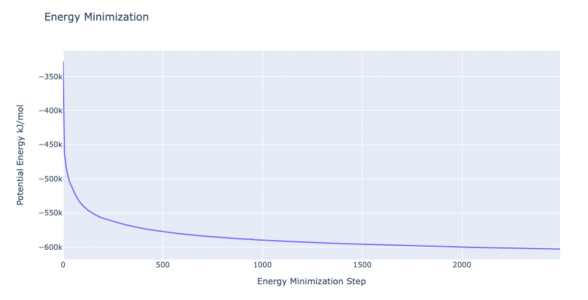

# Protein MD Setup tutorial using BioExcel Building Blocks (biobb)
**Based on the official GROMACS tutorial:** [http://www.mdtutorials.com/gmx/lysozyme/index.html](http://www.mdtutorials.com/gmx/lysozyme/index.html)
***
This tutorial aims to illustrate the process of **setting up a simulation system** containing a **protein**, step by step, using the **BioExcel Building Blocks library (biobb)**. The particular example used is the **Lysozyme** protein (PDB code 1AKI, [https://doi.org/10.2210/pdb1AKI/pdb](https://doi.org/10.2210/pdb1AKI/pdb)). 
***

## Settings

### Biobb modules used

 - [biobb_io](https://github.com/bioexcel/biobb_io): Tools to fetch biomolecular data from public databases.
 - [biobb_model](https://github.com/bioexcel/biobb_model): Tools to model macromolecular structures.
 - [biobb_gromacs](https://github.com/bioexcel/biobb_gromacs): Tools to setup and run Molecular Dynamics simulations.
 - [biobb_analysis](https://github.com/bioexcel/biobb_analysis): Tools to analyse Molecular Dynamics trajectories.
 
### Auxiliary libraries used

* [jupyter](https://jupyter.org/): Free software, open standards, and web services for interactive computing across all programming languages.
* [nglview](http://nglviewer.org/#nglview): Jupyter/IPython widget to interactively view molecular structures and trajectories in notebooks.
* [plotly](https://plot.ly/python/offline/): Python interactive graphing library integrated in Jupyter notebooks.
* [simpletraj](https://github.com/arose/simpletraj): Lightweight coordinate-only trajectory reader based on code from GROMACS, MDAnalysis and VMD.

### Conda Installation and Launch

```console
git clone https://github.com/bioexcel/biobb_wf_md_setup.git
cd biobb_wf_md_setup
conda env create -f conda_env/environment.yml
conda activate biobb_GMX_MDsetup_tutorial
jupyter-notebook biobb_wf_md_setup/notebooks/biobb_MDsetup_tutorial.ipynb
```

***
## Pipeline steps
 1. [Input Parameters](#input)
 2. [Fetching PDB Structure](#fetch)
 3. [Fix Protein Structure](#fix)
 4. [Create Protein System Topology](#top)
 5. [Create Solvent Box](#box)
 6. [Fill the Box with Water Molecules](#water)
 7. [Adding Ions](#ions)
 8. [Energetically Minimize the System](#min)
 9. [Equilibrate the System (NVT)](#nvt)
 10. [Equilibrate the System (NPT)](#npt)
 11. [Free Molecular Dynamics Simulation](#free)
 12. [Post-processing and Visualizing Resulting 3D Trajectory](#post)
 13. [Output Files](#output)
 14. [Questions & Comments](#questions)
 
***

***


## Initializing colab
The two cells below are used only in case this notebook is executed via **Google Colab**. Take into account that, for running conda on **Google Colab**, the **condacolab** library must be installed. As [explained here](https://pypi.org/project/condacolab/), the installation requires a **kernel restart**, so when running this notebook in **Google Colab**, don't run all cells until this **installation** is properly **finished** and the **kernel** has **restarted**.


```python
# Only executed when using google colab
import sys
if 'google.colab' in sys.modules:
  import subprocess
  from pathlib import Path
  try:
    subprocess.run(["conda", "-V"], check=True)
  except FileNotFoundError:
    subprocess.run([sys.executable, "-m", "pip", "install", "condacolab"], check=True)
    import condacolab
    condacolab.install()
    # Clone repository
    repo_URL = "https://github.com/bioexcel/biobb_wf_md_setup.git"
    repo_name = Path(repo_URL).name.split('.')[0]
    if not Path(repo_name).exists():
      subprocess.run(["mamba", "install", "-y", "git"], check=True)
      subprocess.run(["git", "clone", repo_URL], check=True)
      print("⏬ Repository properly cloned.")
    # Install environment
    print("⏳ Creating environment...")
    env_file_path = f"{repo_name}/conda_env/environment.yml"
    subprocess.run(["mamba", "env", "update", "-n", "base", "-f", env_file_path], check=True)
    print("🎨 Install NGLView dependencies...")
    subprocess.run(["mamba", "install", "-y", "-c", "conda-forge", "nglview==3.0.8", "ipywidgets=7.7.2"], check=True)
    print("👍 Conda environment successfully created and updated.")
```


```python
# Enable widgets for colab
if 'google.colab' in sys.modules:
  from google.colab import output
  output.enable_custom_widget_manager()
  # Change working dir
  import os
  os.chdir("biobb_wf_md_setup/biobb_wf_md_setup/notebooks")
  print(f"📂 New working directory: {os.getcwd()}")
```

<a id="input"></a>
## Input parameters
**Input parameters** needed:
 - **pdbCode**: PDB code of the protein structure (e.g. 1AKI, [https://doi.org/10.2210/pdb1AKI/pdb](https://doi.org/10.2210/pdb1AKI/pdb))


```python
import nglview
import ipywidgets

pdbCode = "1AKI"
```

<a id="fetch"></a>
***
## Fetching PDB structure
Downloading **PDB structure** with the **protein molecule** from the RCSB PDB database.<br>
Alternatively, a **PDB file** can be used as starting structure. <br>
***
**Building Blocks** used:
 - [Pdb](https://biobb-io.readthedocs.io/en/latest/api.html#module-api.pdb) from **biobb_io.api.pdb**
***


```python
# Downloading desired PDB file 
# Import module
from biobb_io.api.pdb import pdb

# Create properties dict and inputs/outputs
downloaded_pdb = pdbCode+'.pdb'
prop = {
    'pdb_code': pdbCode
}

#Create and launch bb
pdb(output_pdb_path=downloaded_pdb,
    properties=prop)
```

<a id="vis3D"></a>
### Visualizing 3D structure
Visualizing the downloaded/given **PDB structure** using **NGL**:    


```python
# Show protein
view = nglview.show_structure_file(downloaded_pdb)
view.add_representation(repr_type='ball+stick', selection='all')
view._remote_call('setSize', target='Widget', args=['','600px'])
view
```

</img>

<a id="fix"></a>
***
## Fix protein structure
**Checking** and **fixing** (if needed) the protein structure:<br>
- **Modeling** **missing side-chain atoms**, modifying incorrect **amide assignments**, choosing **alternative locations**.<br>
- **Checking** for missing **backbone atoms**, **heteroatoms**, **modified residues** and possible **atomic clashes**.

***
**Building Blocks** used:
 - [FixSideChain](https://biobb-model.readthedocs.io/en/latest/model.html#module-model.fix_side_chain) from **biobb_model.model.fix_side_chain**
***


```python
# Check & Fix PDB
# Import module
from biobb_model.model.fix_side_chain import fix_side_chain

# Create prop dict and inputs/outputs
fixed_pdb = pdbCode + '_fixed.pdb'

# Create and launch bb
fix_side_chain(input_pdb_path=downloaded_pdb, 
             output_pdb_path=fixed_pdb)
```

### Visualizing 3D structure
Visualizing the fixed **PDB structure** using **NGL**. In this particular example, the checking step didn't find any issue to be solved, so there is no difference between the original structure and the fixed one.   


```python
# Show protein
view = nglview.show_structure_file(fixed_pdb)
view.add_representation(repr_type='ball+stick', selection='all')
view._remote_call('setSize', target='Widget', args=['','600px'])
view.camera='orthographic'
view
```

</img>

<a id="top"></a>
***
## Create protein system topology
**Building GROMACS topology** corresponding to the protein structure.<br>
Force field used in this tutorial is [**amber99sb-ildn**](https://dx.doi.org/10.1002%2Fprot.22711): AMBER **parm99** force field with **corrections on backbone** (sb) and **side-chain torsion potentials** (ildn). Water molecules type used in this tutorial is [**spc/e**](https://pubs.acs.org/doi/abs/10.1021/j100308a038).<br>
Adding **hydrogen atoms** if missing. Automatically identifying **disulfide bridges**. <br>

Generating two output files: 
- **GROMACS structure** (gro file)
- **GROMACS topology** ZIP compressed file containing:
    - *GROMACS topology top file* (top file)
    - *GROMACS position restraint file/s* (itp file/s)
***
**Building Blocks** used:
 - [Pdb2gmx](https://biobb-md.readthedocs.io/en/latest/gromacs.html#module-gromacs.pdb2gmx) from **biobb_gromacs.gromacs.pdb2gmx**
***


```python
# Create system topology
# Import module
from biobb_gromacs.gromacs.pdb2gmx import pdb2gmx

# Create inputs/outputs
output_pdb2gmx_gro = pdbCode+'_pdb2gmx.gro'
output_pdb2gmx_top_zip = pdbCode+'_pdb2gmx_top.zip'

# Create and launch bb
pdb2gmx(input_pdb_path=fixed_pdb, 
        output_gro_path=output_pdb2gmx_gro, 
        output_top_zip_path=output_pdb2gmx_top_zip)
```

### Visualizing 3D structure
Visualizing the generated **GRO structure** using **NGL**. Note that **hydrogen atoms** were added to the structure by the **pdb2gmx GROMACS tool** when generating the **topology**.    


```python
# Show protein
view = nglview.show_structure_file(output_pdb2gmx_gro)
view.add_representation(repr_type='ball+stick', selection='all')
view._remote_call('setSize', target='Widget', args=['','600px'])
view.camera='orthographic'
view
```

</img>

<a id="box"></a>
***
## Create solvent box
Define the unit cell for the **protein structure MD system** to fill it with water molecules.<br>
A **cubic box** is used to define the unit cell, with a **distance from the protein to the box edge of 1.0 nm**. The protein is **centered in the box**.  

***
**Building Blocks** used:
 - [Editconf](https://biobb-md.readthedocs.io/en/latest/gromacs.html#module-gromacs.editconf) from **biobb_gromacs.gromacs.editconf** 
***


```python
# Editconf: Create solvent box
# Import module
from biobb_gromacs.gromacs.editconf import editconf

# Create prop dict and inputs/outputs
output_editconf_gro = pdbCode+'_editconf.gro'

prop = {
    'box_type': 'cubic',
    'distance_to_molecule': 1.0
}

#Create and launch bb
editconf(input_gro_path=output_pdb2gmx_gro, 
         output_gro_path=output_editconf_gro,
         properties=prop)
```

<a id="water"></a>
***
## Fill the box with water molecules
Fill the unit cell for the **protein structure system** with water molecules.<br>
The solvent type used is the default **Simple Point Charge water (SPC)**, a generic equilibrated 3-point solvent model. 

***
**Building Blocks** used:
 - [Solvate](https://biobb-md.readthedocs.io/en/latest/gromacs.html#module-gromacs.solvate) from **biobb_gromacs.gromacs.solvate** 
***


```python
# Solvate: Fill the box with water molecules
from biobb_gromacs.gromacs.solvate import solvate

# Create prop dict and inputs/outputs
output_solvate_gro = pdbCode+'_solvate.gro'
output_solvate_top_zip = pdbCode+'_solvate_top.zip'

# Create and launch bb
solvate(input_solute_gro_path=output_editconf_gro, 
        output_gro_path=output_solvate_gro, 
        input_top_zip_path=output_pdb2gmx_top_zip, 
        output_top_zip_path=output_solvate_top_zip)
```

### Visualizing 3D structure
Visualizing the **protein system** with the newly added **solvent box** using **NGL**.<br> Note the **cubic box** filled with **water molecules** surrounding the **protein structure**, which is **centered** right in the middle of the cube.


```python
# Show protein
view = nglview.show_structure_file(output_solvate_gro)
view.clear_representations()
view.add_representation(repr_type='cartoon', selection='solute', color='green')
view.add_representation(repr_type='ball+stick', selection='SOL')
view._remote_call('setSize', target='Widget', args=['','600px'])
view.camera='orthographic'
view
```

</img>

<a id="ions"></a>
***
## Adding ions
Add ions to neutralize the **protein structure** charge
- [Step 1](#ionsStep1): Creating portable binary run file for ion generation
- [Step 2](#ionsStep2): Adding ions to **neutralize** the system
***
**Building Blocks** used:
 - [Grompp](https://biobb-md.readthedocs.io/en/latest/gromacs.html#module-gromacs.grompp) from **biobb_gromacs.gromacs.grompp** 
 - [Genion](https://biobb-md.readthedocs.io/en/latest/gromacs.html#module-gromacs.genion) from **biobb_gromacs.gromacs.genion** 
***

<a id="ionsStep1"></a>
### Step 1: Creating portable binary run file for ion generation
A simple **energy minimization** molecular dynamics parameters (mdp) properties will be used to generate the portable binary run file for **ion generation**, although **any legitimate combination of parameters** could be used in this step.


```python
# Grompp: Creating portable binary run file for ion generation
from biobb_gromacs.gromacs.grompp import grompp

# Create prop dict and inputs/outputs
output_gppion_tpr = pdbCode+'_gppion.tpr'
prop = {
    'simulation_type': 'minimization',
    'maxwarn': 1
}

# Create and launch bb
grompp(input_gro_path=output_solvate_gro, 
       input_top_zip_path=output_solvate_top_zip, 
       output_tpr_path=output_gppion_tpr,  
       properties=prop)
```

<a id="ionsStep2"></a>
### Step 2: Adding ions to neutralize the system
Replace **solvent molecules** with **ions** to **neutralize** the system.


```python
# Genion: Adding ions to neutralize the system
from biobb_gromacs.gromacs.genion import genion

# Create prop dict and inputs/outputs
output_genion_gro = pdbCode+'_genion.gro'
output_genion_top_zip = pdbCode+'_genion_top.zip'
prop={
    'neutral':True
}

# Create and launch bb
genion(input_tpr_path=output_gppion_tpr, 
       output_gro_path=output_genion_gro, 
       input_top_zip_path=output_solvate_top_zip, 
       output_top_zip_path=output_genion_top_zip, 
       properties=prop)
```

### Visualizing 3D structure
Visualizing the **neutralized protein system** with the newly added **ions** using **NGL**


```python
# Show protein
view = nglview.show_structure_file(output_genion_gro)
view.clear_representations()
view.add_representation(repr_type='cartoon', selection='solute', color='sstruc')
view.add_representation(repr_type='ball+stick', selection='NA')
view.add_representation(repr_type='ball+stick', selection='CL')
view._remote_call('setSize', target='Widget', args=['','600px'])
view.camera='orthographic'
view
```

</img>

<a id="min"></a>
***
## Energetically minimize the system
Energetically minimize the **protein system** till reaching a desired potential energy.
- [Step 1](#emStep1): Creating portable binary run file for energy minimization
- [Step 2](#emStep2): Energetically minimize the **system** till reaching a force of 500 kJ/mol*nm.
- [Step 3](#emStep3): Checking **energy minimization** results. Plotting energy by time during the **minimization** process.
***
**Building Blocks** used:
 - [Grompp](https://biobb-md.readthedocs.io/en/latest/gromacs.html#module-gromacs.grompp) from **biobb_gromacs.gromacs.grompp** 
 - [Mdrun](https://biobb-md.readthedocs.io/en/latest/gromacs.html#module-gromacs.mdrun) from **biobb_gromacs.gromacs.mdrun** 
 - [GMXEnergy](https://biobb-analysis.readthedocs.io/en/latest/gromacs.html#module-gromacs.gmx_energy) from **biobb_analysis.gromacs.gmx_energy** 
***

<a id="emStep1"></a>
### Step 1: Creating portable binary run file for energy minimization
The **minimization** type of the **molecular dynamics parameters (mdp) property** contains the main default parameters to run an **energy minimization**:

-  integrator  = steep ; Algorithm (steep = steepest descent minimization)
-  emtol       = 1000.0 ; Stop minimization when the maximum force < 1000.0 kJ/mol/nm
-  emstep      = 0.01 ; Minimization step size (nm)
-  nsteps      = 50000 ; Maximum number of (minimization) steps to perform

In this particular example, the method used to run the **energy minimization** is the default **steepest descent**, but the **maximum force** is placed at **500 kJ/mol\*nm^2**, and the **maximum number of steps** to perform (if the maximum force is not reached) to **5,000 steps**. 


```python
# Grompp: Creating portable binary run file for mdrun
from biobb_gromacs.gromacs.grompp import grompp

# Create prop dict and inputs/outputs
output_gppmin_tpr = pdbCode+'_gppmin.tpr'
prop = {
    'mdp':{
        'emtol':'500',
        'nsteps':'5000'
    },
    'simulation_type': 'minimization'
}

# Create and launch bb
grompp(input_gro_path=output_genion_gro, 
       input_top_zip_path=output_genion_top_zip, 
       output_tpr_path=output_gppmin_tpr,  
       properties=prop)
```

<a id="emStep2"></a>
### Step 2: Running Energy Minimization
Running **energy minimization** using the **tpr file** generated in the previous step. 


```python
# Mdrun: Running minimization
from biobb_gromacs.gromacs.mdrun import mdrun

# Create prop dict and inputs/outputs
output_min_trr = pdbCode+'_min.trr'
output_min_gro = pdbCode+'_min.gro'
output_min_edr = pdbCode+'_min.edr'
output_min_log = pdbCode+'_min.log'

# Create and launch bb
mdrun(input_tpr_path=output_gppmin_tpr, 
      output_trr_path=output_min_trr, 
      output_gro_path=output_min_gro, 
      output_edr_path=output_min_edr, 
      output_log_path=output_min_log)
```

<a id="emStep3"></a>
### Step 3: Checking Energy Minimization results
Checking **energy minimization** results. Plotting **potential energy** by time during the minimization process. 


```python
# GMXEnergy: Getting system energy by time  
from biobb_analysis.gromacs.gmx_energy import gmx_energy

# Create prop dict and inputs/outputs
output_min_ene_xvg = pdbCode+'_min_ene.xvg'
prop = {
    'terms':  ["Potential"]
}

# Create and launch bb
gmx_energy(input_energy_path=output_min_edr, 
          output_xvg_path=output_min_ene_xvg, 
          properties=prop)
```


```python
import plotly.graph_objs as go

# Read data from file and filter energy values higher than 1000 kJ/mol
with open(output_min_ene_xvg, 'r') as energy_file:
    x, y = zip(*[
        (float(line.split()[0]), float(line.split()[1]))
        for line in energy_file
        if not line.startswith(("#", "@"))
        if float(line.split()[1]) < 1000
    ])

# Create a scatter plot
fig = go.Figure(data=go.Scatter(x=x, y=y, mode='lines'))

# Update layout
fig.update_layout(title="Energy Minimization",
                  xaxis_title="Energy Minimization Step",
                  yaxis_title="Potential Energy kJ/mol",
                  height=600)

# Show the figure (renderer changes for colab and jupyter)
rend = 'colab' if 'google.colab' in sys.modules else ''
fig.show(renderer=rend)
```

</img>

<a id="nvt"></a>
***
## Equilibrate the system (NVT)
Equilibrate the **protein system** in **NVT ensemble** (constant Number of particles, Volume and Temperature). Protein **heavy atoms** will be restrained using position restraining forces: movement is permitted, but only after overcoming a substantial energy penalty. The utility of position restraints is that they allow us to equilibrate our solvent around our protein, without the added variable of structural changes in the protein.

- [Step 1](#eqNVTStep1): Creating portable binary run file for system equilibration
- [Step 2](#eqNVTStep2): Equilibrate the **protein system** with **NVT** ensemble.
- [Step 3](#eqNVTStep3): Checking **NVT Equilibration** results. Plotting **system temperature** by time during the **NVT equilibration** process. 
***
**Building Blocks** used:
- [Grompp](https://biobb-md.readthedocs.io/en/latest/gromacs.html#module-gromacs.grompp) from **biobb_gromacs.gromacs.grompp** 
- [Mdrun](https://biobb-md.readthedocs.io/en/latest/gromacs.html#module-gromacs.mdrun) from **biobb_gromacs.gromacs.mdrun** 
- [GMXEnergy](https://biobb-analysis.readthedocs.io/en/latest/gromacs.html#module-gromacs.gmx_energy) from **biobb_analysis.gromacs.gmx_energy** 
***

<a id="eqNVTStep1"></a>
### Step 1: Creating portable binary run file for system equilibration (NVT)
The **nvt** type of the **molecular dynamics parameters (mdp) property** contains the main default parameters to run an **NVT equilibration** with **protein restraints** (see [GROMACS mdp options](http://manual.gromacs.org/documentation/2018/user-guide/mdp-options.html)):

-  Define                   = -DPOSRES
-  integrator               = md
-  dt                       = 0.002
-  nsteps                   = 5000
-  pcoupl                   = no
-  gen_vel                  = yes
-  gen_temp                 = 300
-  gen_seed                 = -1

In this particular example, the default parameters will be used: **md** integrator algorithm, a **step size** of **2fs**, **5,000 equilibration steps** with the protein **heavy atoms restrained**, and a temperature of **300K**.

*Please note that for the sake of time this tutorial is only running 10ps of NVT equilibration, whereas in the [original example](http://www.mdtutorials.com/gmx/lysozyme/06_equil.html) the simulated time was 100ps.*


```python
# Grompp: Creating portable binary run file for NVT Equilibration
from biobb_gromacs.gromacs.grompp import grompp

# Create prop dict and inputs/outputs
output_gppnvt_tpr = pdbCode+'_gppnvt.tpr'
prop = {
    'mdp':{
        'nsteps': 5000,
        'dt': 0.002,
        'Define': '-DPOSRES',
        #'tc_grps': "DNA Water_and_ions" # NOTE: uncomment this line if working with DNA
    },
    'simulation_type': 'nvt'
}

# Create and launch bb
grompp(input_gro_path=output_min_gro, 
       input_top_zip_path=output_genion_top_zip, 
       output_tpr_path=output_gppnvt_tpr,  
       properties=prop)
```

<a id="eqNVTStep2"></a>
### Step 2: Running NVT equilibration


```python
# Mdrun: Running Equilibration NVT
from biobb_gromacs.gromacs.mdrun import mdrun

# Create prop dict and inputs/outputs
output_nvt_trr = pdbCode+'_nvt.trr'
output_nvt_gro = pdbCode+'_nvt.gro'
output_nvt_edr = pdbCode+'_nvt.edr'
output_nvt_log = pdbCode+'_nvt.log'
output_nvt_cpt = pdbCode+'_nvt.cpt'

# Create and launch bb
mdrun(input_tpr_path=output_gppnvt_tpr, 
      output_trr_path=output_nvt_trr, 
      output_gro_path=output_nvt_gro, 
      output_edr_path=output_nvt_edr, 
      output_log_path=output_nvt_log, 
      output_cpt_path=output_nvt_cpt)
```

<a id="eqNVTStep3"></a>
### Step 3: Checking NVT Equilibration results
Checking **NVT Equilibration** results. Plotting **system temperature** by time during the NVT equilibration process. 


```python
# GMXEnergy: Getting system temperature by time during NVT Equilibration  
from biobb_analysis.gromacs.gmx_energy import gmx_energy

# Create prop dict and inputs/outputs
output_nvt_temp_xvg = pdbCode+'_nvt_temp.xvg'
prop = {
    'terms':  ["Temperature"]
}

# Create and launch bb
gmx_energy(input_energy_path=output_nvt_edr, 
          output_xvg_path=output_nvt_temp_xvg, 
          properties=prop)
```


```python
import plotly.graph_objs as go

# Read temperature data from file
with open(output_nvt_temp_xvg, 'r') as temperature_file:
    x, y = zip(*[
        (float(line.split()[0]), float(line.split()[1]))
        for line in temperature_file
        if not line.startswith(("#", "@"))
    ])

# Create a scatter plot
fig = go.Figure(data=go.Scatter(x=x, y=y, mode='lines+markers'))

# Update layout
fig.update_layout(title="Temperature during NVT Equilibration",
                  xaxis_title="Time (ps)",
                  yaxis_title="Temperature (K)",
                  height=600)

# Show the figure (renderer changes for colab and jupyter)
rend = 'colab' if 'google.colab' in sys.modules else ''
fig.show(renderer=rend)
```

</img>

<a id="npt"></a>
***
## Equilibrate the system (NPT)
Equilibrate the **protein system** in **NPT** ensemble (constant Number of particles, Pressure and Temperature).
- [Step 1](#eqNPTStep1): Creating portable binary run file for system equilibration
- [Step 2](#eqNPTStep2): Equilibrate the **protein system** with **NPT** ensemble.
- [Step 3](#eqNPTStep3): Checking **NPT Equilibration** results. Plotting **system pressure and density** by time during the **NPT equilibration** process.
***
**Building Blocks** used:
 - [Grompp](https://biobb-md.readthedocs.io/en/latest/gromacs.html#module-gromacs.grompp) from **biobb_gromacs.gromacs.grompp** 
 - [Mdrun](https://biobb-md.readthedocs.io/en/latest/gromacs.html#module-gromacs.mdrun) from **biobb_gromacs.gromacs.mdrun** 
 - [GMXEnergy](https://biobb-analysis.readthedocs.io/en/latest/gromacs.html#module-gromacs.gmx_energy) from **biobb_analysis.gromacs.gmx_energy** 
***

<a id="eqNPTStep1"></a>
### Step 1: Creating portable binary run file for system equilibration (NPT)

The **npt** type of the **molecular dynamics parameters (mdp) property** contains the main default parameters to run an **NPT equilibration** with **protein restraints** (see [GROMACS mdp options](http://manual.gromacs.org/documentation/2018/user-guide/mdp-options.html)):

-  Define                   = -DPOSRES
-  integrator               = md
-  dt                       = 0.002
-  nsteps                   = 5000
-  pcoupl = Parrinello-Rahman
-  pcoupltype = isotropic
-  tau_p = 1.0
-  ref_p = 1.0
-  compressibility = 4.5e-5
-  refcoord_scaling = com
-  gen_vel = no

In this particular example, the default parameters will be used: **md** integrator algorithm, a **time step** of **2fs**, **5,000 equilibration steps** with the protein **heavy atoms restrained**, and a Parrinello-Rahman **pressure coupling** algorithm.

*Please note that for the sake of time this tutorial is only running 10ps of NPT equilibration, whereas in the [original example](http://www.mdtutorials.com/gmx/lysozyme/07_equil2.html) the simulated time was 100ps.*


```python
# Grompp: Creating portable binary run file for NPT System Equilibration
from biobb_gromacs.gromacs.grompp import grompp

# Create prop dict and inputs/outputs
output_gppnpt_tpr = pdbCode+'_gppnpt.tpr'
prop = {
    'mdp':{
        'nsteps':'5000',
        #'tc_grps': "DNA Water_and_ions" # NOTE: uncomment this line if working with DNA
    },
    'simulation_type': 'npt'
}

# Create and launch bb
grompp(input_gro_path=output_nvt_gro, 
       input_top_zip_path=output_genion_top_zip, 
       output_tpr_path=output_gppnpt_tpr, 
       input_cpt_path=output_nvt_cpt,  
       properties=prop)
```

<a id="eqNPTStep2"></a>
### Step 2: Running NPT equilibration


```python
# Mdrun: Running NPT System Equilibration
from biobb_gromacs.gromacs.mdrun import mdrun

# Create prop dict and inputs/outputs
output_npt_trr = pdbCode+'_npt.trr'
output_npt_gro = pdbCode+'_npt.gro'
output_npt_edr = pdbCode+'_npt.edr'
output_npt_log = pdbCode+'_npt.log'
output_npt_cpt = pdbCode+'_npt.cpt'

# Create and launch bb
mdrun(input_tpr_path=output_gppnpt_tpr, 
      output_trr_path=output_npt_trr, 
      output_gro_path=output_npt_gro, 
      output_edr_path=output_npt_edr, 
      output_log_path=output_npt_log, 
      output_cpt_path=output_npt_cpt)
```

<a id="eqNPTStep3"></a>
### Step 3: Checking NPT Equilibration results
Checking **NPT Equilibration** results. Plotting **system pressure and density** by time during the **NPT equilibration** process. 


```python
# GMXEnergy: Getting system pressure and density by time during NPT Equilibration  
from biobb_analysis.gromacs.gmx_energy import gmx_energy

# Create prop dict and inputs/outputs
output_npt_pd_xvg = pdbCode+'_npt_PD.xvg'
prop = {
    'terms':  ["Pressure","Density"]
}

# Create and launch bb
gmx_energy(input_energy_path=output_npt_edr, 
          output_xvg_path=output_npt_pd_xvg, 
          properties=prop)
```


```python
import plotly.graph_objs as go
from plotly.subplots import make_subplots

# Read pressure and density data from file 
with open(output_npt_pd_xvg,'r') as pd_file:
    x, y, z = zip(*[
        (float(line.split()[0]), float(line.split()[1]), float(line.split()[2]))
        for line in pd_file
        if not line.startswith(("#", "@"))
    ])

trace1 = go.Scatter(
    x=x,y=y
)
trace2 = go.Scatter(
    x=x,y=z
)

fig = make_subplots(rows=1, cols=2, print_grid=False)
fig.append_trace(trace1, 1, 1)
fig.append_trace(trace2, 1, 2)

fig.update_layout(
    height=500,
    title='Pressure and Density during NPT Equilibration',
    showlegend=False,
    xaxis1_title='Time (ps)',
    yaxis1_title='Pressure (bar)',
    xaxis2_title='Time (ps)',
    yaxis2_title='Density (Kg*m^-3)'
)

# Show the figure (renderer changes for colab and jupyter)
rend = 'colab' if 'google.colab' in sys.modules else ''
fig.show(renderer=rend)
```

</img>

<a id="free"></a>
***
## Free Molecular Dynamics Simulation
Upon completion of the **two equilibration phases (NVT and NPT)**, the system is now well-equilibrated at the desired temperature and pressure. The **position restraints** can now be released. The last step of the **protein** MD setup is a short, **free MD simulation**, to ensure the robustness of the system. 
- [Step 1](#mdStep1): Creating portable binary run file to run a **free MD simulation**.
- [Step 2](#mdStep2): Run short MD simulation of the **protein system**.
- [Step 3](#mdStep3): Checking results for the final step of the setup process, the **free MD run**. Plotting **Root Mean Square deviation (RMSd)** and **Radius of Gyration (Rgyr)** by time during the **free MD run** step. 
***
**Building Blocks** used:
 - [Grompp](https://biobb-md.readthedocs.io/en/latest/gromacs.html#module-gromacs.grompp) from **biobb_gromacs.gromacs.grompp** 
 - [Mdrun](https://biobb-md.readthedocs.io/en/latest/gromacs.html#module-gromacs.mdrun) from **biobb_gromacs.gromacs.mdrun** 
 - [GMXRms](https://biobb-analysis.readthedocs.io/en/latest/gromacs.html#module-gromacs.gmx_rms) from **biobb_analysis.gromacs.gmx_rms** 
 - [GMXRgyr](https://biobb-analysis.readthedocs.io/en/latest/gromacs.html#module-gromacs.gmx_rgyr) from **biobb_analysis.gromacs.gmx_rgyr** 
***

<a id="mdStep1"></a>
### Step 1: Creating portable binary run file to run a free MD simulation

The **free** type of the **molecular dynamics parameters (mdp) property** contains the main default parameters to run an **free MD simulation** (see [GROMACS mdp options](http://manual.gromacs.org/documentation/2018/user-guide/mdp-options.html)):

-  integrator               = md
-  dt                       = 0.002 (ps)
-  nsteps                   = 50000

In this particular example, the default parameters will be used: **md** integrator algorithm, a **time step** of **2fs**, and a total of **50,000 md steps** (100ps).

*Please note that for the sake of time this tutorial is only running 100ps of free MD, whereas in the [original example](http://www.mdtutorials.com/gmx/lysozyme/08_MD.html) the simulated time was 1ns (1000ps).*


```python
# Grompp: Creating portable binary run file for mdrun
from biobb_gromacs.gromacs.grompp import grompp

# Create prop dict and inputs/outputs
output_gppmd_tpr = pdbCode+'_gppmd.tpr'
prop = {
    'mdp':{
        'nsteps':'50000',
        #'tc_grps': "DNA Water_and_ions" # NOTE: uncomment this line if working with DNA
    },
    'simulation_type': 'free'
}

# Create and launch bb
grompp(input_gro_path=output_npt_gro, 
       input_top_zip_path=output_genion_top_zip, 
       output_tpr_path=output_gppmd_tpr, 
       input_cpt_path=output_npt_cpt, 
       properties=prop)
```

<a id="mdStep2"></a>
### Step 2: Running short free MD simulation


```python
# Mdrun: Running free dynamics
from biobb_gromacs.gromacs.mdrun import mdrun

# Create prop dict and inputs/outputs
output_md_trr = pdbCode+'_md.trr'
output_md_gro = pdbCode+'_md.gro'
output_md_edr = pdbCode+'_md.edr'
output_md_log = pdbCode+'_md.log'
output_md_cpt = pdbCode+'_md.cpt'

# Create and launch bb
mdrun(input_tpr_path=output_gppmd_tpr, 
      output_trr_path=output_md_trr, 
      output_gro_path=output_md_gro, 
      output_edr_path=output_md_edr, 
      output_log_path=output_md_log, 
      output_cpt_path=output_md_cpt)
```

<a id="mdStep3"></a>
### Step 3: Checking free MD simulation results
Checking results for the final step of the setup process, the **free MD run**. Plotting **Root Mean Square deviation (RMSd)** and **Radius of Gyration (Rgyr)** by time during the **free MD run** step. **RMSd** against the **experimental structure** (input structure of the pipeline) and against the **minimized and equilibrated structure** (output structure of the NPT equilibration step).


```python
# GMXRms: Computing Root Mean Square deviation to analyse structural stability 
#         RMSd against minimized and equilibrated snapshot (backbone atoms)   

from biobb_analysis.gromacs.gmx_rms import gmx_rms

# Create prop dict and inputs/outputs
output_rms_first = pdbCode+'_rms_first.xvg'
prop = {
    'selection':  'Backbone',
    #'selection': 'non-Water'
}

# Create and launch bb
gmx_rms(input_structure_path=output_gppmd_tpr,
         input_traj_path=output_md_trr,
         output_xvg_path=output_rms_first, 
          properties=prop)
```


```python
# GMXRms: Computing Root Mean Square deviation to analyse structural stability 
#         RMSd against experimental structure (backbone atoms)   

from biobb_analysis.gromacs.gmx_rms import gmx_rms

# Create prop dict and inputs/outputs
output_rms_exp = pdbCode+'_rms_exp.xvg'
prop = {
    'selection':  'Backbone',
    #'selection': 'non-Water'
}

# Create and launch bb
gmx_rms(input_structure_path=output_gppmin_tpr,
         input_traj_path=output_md_trr,
         output_xvg_path=output_rms_exp, 
          properties=prop)
```


```python
import plotly.graph_objs as go

# Read RMS vs first snapshot data from file 
with open(output_rms_first,'r') as rms_first_file:
    x, y = zip(*[
        (float(line.split()[0]), float(line.split()[1]))
        for line in rms_first_file
        if not line.startswith(("#", "@"))
    ])

# Read RMS vs experimental structure data from file 
with open(output_rms_exp,'r') as rms_exp_file:
    x2, y2 = zip(*[
        (float(line.split()[0]), float(line.split()[1]))
        for line in rms_exp_file
        if not line.startswith(("#", "@"))
    ])

fig = make_subplots()
fig.add_trace(go.Scatter(x=x, y=y, mode="lines+markers", name="RMSd vs first"))
fig.add_trace(go.Scatter(x=x, y=y2, mode="lines+markers", name="RMSd vs exp"))

# Set layout including height
fig.update_layout(
    title="RMSd during free MD Simulation",
    xaxis=dict(title="Time (ps)"),
    yaxis=dict(title="RMSd (nm)"),
    height=600
)

# Show the figure (renderer changes for colab and jupyter)
rend = 'colab' if 'google.colab' in sys.modules else ''
fig.show(renderer=rend)
```

</img>


```python
# GMXRgyr: Computing Radius of Gyration to measure the protein compactness during the free MD simulation 

from biobb_analysis.gromacs.gmx_rgyr import gmx_rgyr

# Create prop dict and inputs/outputs
output_rgyr = pdbCode+'_rgyr.xvg'
prop = {
    'selection':  'Backbone'
}

# Create and launch bb
gmx_rgyr(input_structure_path=output_gppmin_tpr,
         input_traj_path=output_md_trr,
         output_xvg_path=output_rgyr, 
          properties=prop)
```


```python
import plotly.graph_objs as go

# Read Rgyr data from file
with open(output_rgyr, 'r') as rgyr_file:
    x, y = zip(*[
        (float(line.split()[0]), float(line.split()[1]))
        for line in rgyr_file
        if not line.startswith(("#", "@"))
    ])

# Create a scatter plot
fig = go.Figure(data=go.Scatter(x=x, y=y, mode='lines+markers'))

# Update layout
fig.update_layout(title="Radius of Gyration",
                  xaxis_title="Time (ps)",
                  yaxis_title="Rgyr (nm)",
                  height=600)

# Show the figure (renderer changes for colab and jupyter)
rend = 'colab' if 'google.colab' in sys.modules else ''
fig.show(renderer=rend)
```

</img>

<a id="post"></a>
***
## Post-processing and Visualizing resulting 3D trajectory
Post-processing and Visualizing the **protein system** MD setup **resulting trajectory** using **NGL**
- [Step 1](#ppStep1): *Imaging* the resulting trajectory, **stripping out water molecules and ions** and **correcting periodicity issues**.
- [Step 2](#ppStep2): Generating a *dry* structure, **removing water molecules and ions** from the final snapshot of the MD setup pipeline.
- [Step 3](#ppStep3): Visualizing the *imaged* trajectory using the *dry* structure as a **topology**. 
***
**Building Blocks** used:
 - [GMXImage](https://biobb-analysis.readthedocs.io/en/latest/gromacs.html#module-gromacs.gmx_image) from **biobb_analysis.gromacs.gmx_image** 
 - [GMXTrjConvStr](https://biobb-analysis.readthedocs.io/en/latest/gromacs.html#module-gromacs.gmx_trjconv_str) from **biobb_analysis.gromacs.gmx_trjconv_str** 
***

<a id="ppStep1"></a>
### Step 1: *Imaging* the resulting trajectory.
Stripping out **water molecules and ions** and **correcting periodicity issues**  


```python
# GMXImage: "Imaging" the resulting trajectory
#           Removing water molecules and ions from the resulting structure
from biobb_analysis.gromacs.gmx_image import gmx_image

# Create prop dict and inputs/outputs
output_imaged_traj = pdbCode+'_imaged_traj.trr'
prop = {
    'center_selection':  'Protein',
    'output_selection': 'Protein',
    'pbc' : 'mol',
    'center' : True
}

# Create and launch bb
gmx_image(input_traj_path=output_md_trr,
         input_top_path=output_gppmd_tpr,
         output_traj_path=output_imaged_traj, 
          properties=prop)
```

<a id="ppStep2"></a>
### Step 2: Generating the output *dry* structure.
**Removing water molecules and ions** from the resulting structure


```python
# GMXTrjConvStr: Converting and/or manipulating a structure
#                Removing water molecules and ions from the resulting structure
#                The "dry" structure will be used as a topology to visualize 
#                the "imaged dry" trajectory generated in the previous step.
from biobb_analysis.gromacs.gmx_trjconv_str import gmx_trjconv_str

# Create prop dict and inputs/outputs
output_dry_gro = pdbCode+'_md_dry.gro'
prop = {
    'selection':  'Protein'
}

# Create and launch bb
gmx_trjconv_str(input_structure_path=output_md_gro,
         input_top_path=output_gppmd_tpr,
         output_str_path=output_dry_gro, 
          properties=prop)
```

<a id="ppStep3"></a>
### Step 3: Visualizing the generated dehydrated trajectory.
Using the **imaged trajectory** (output of the [Post-processing step 1](#ppStep1)) with the **dry structure** (output of the [Post-processing step 2](#ppStep2)) as a topology.


```python
# Show trajectory
view = nglview.show_simpletraj(nglview.SimpletrajTrajectory(output_imaged_traj, output_dry_gro), gui=True)
view
```

</img>

<a id="output"></a>
## Output files

Important **Output files** generated:
 - {{output_md_gro}}: **Final structure** (snapshot) of the MD setup protocol.
 - {{output_md_trr}}: **Final trajectory** of the MD setup protocol.
 - {{output_md_cpt}}: **Final checkpoint file**, with information about the state of the simulation. It can be used to **restart** or **continue** a MD simulation.
 - {{output_gppmd_tpr}}: **Final tpr file**, GROMACS portable binary run input file. This file contains the starting structure of the **MD setup free MD simulation step**, together with the molecular topology and all the simulation parameters. It can be used to **extend** the simulation.
 - {{output_genion_top_zip}}: **Final topology** of the MD system. It is a compressed zip file including a **topology file** (.top) and a set of auxiliary **include topology** files (.itp).

**Analysis** (MD setup check) output files generated:
 - {{output_rms_first}}: **Root Mean Square deviation (RMSd)** against **minimized and equilibrated structure** of the final **free MD run step**.
 - {{output_rms_exp}}: **Root Mean Square deviation (RMSd)** against **experimental structure** of the final **free MD run step**.
 - {{output_rgyr}}: **Radius of Gyration** of the final **free MD run step** of the **setup pipeline**.
 

***
<a id="questions"></a>

## Questions & Comments

Questions, issues, suggestions and comments are really welcome!

* GitHub issues:
    * [https://github.com/bioexcel/biobb](https://github.com/bioexcel/biobb)

* BioExcel forum:
    * [https://ask.bioexcel.eu/c/BioExcel-Building-Blocks-library](https://ask.bioexcel.eu/c/BioExcel-Building-Blocks-library)

